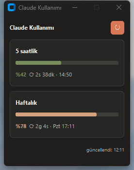

# Claude Counter

Claude aboneliğinizin ne kadarını kullandığınızı gösteren, her zaman üstte
duran küçük bir Windows masaüstü widget'ı: 5 saatlik ve haftalık dilim, her
biri için renkli bir çubuk, canlı geri sayım ve sıfırlanmanın yerel saati.

*English: [README.md](README.md)*



## Gereksinimler

- Windows
- [Python 3.10+](https://www.python.org/downloads/) (3.11.9 ile test edildi) —
  kurulumda **"Add python.exe to PATH"** kutusunu işaretleyin
- Kurulu ve giriş yapılmış [Claude Code](https://claude.com/claude-code) —
  widget onun oturumunu okur

> **İhtiyaç duyduğu şeyle gösterdiği şey aynı değil.**
>
> *Oturumu* Claude Code'un oturum dosyasından alır; bu yüzden Claude Code'un
> kurulu ve giriş yapılmış olması gerekir. Claude'u yalnızca web'de
> kullanıyorsanız okuyacağı bir oturum dosyası olmaz ve widget başlayamaz.
>
> *Gösterdiği* şey ise hesabınızın tamamıdır. 5 saatlik ve haftalık limitler
> tek bir uygulamaya değil aboneliğinize aittir; dolayısıyla yaptığınız her
> şey aynı çubuklara yazılır: terminaldeki Claude Code, VS Code ve JetBrains
> eklentileri, tarayıcıdaki claude.ai, masaüstü uygulaması ve Cowork.
> Bunların herhangi birindeki kullanım yüzdeleri hareket ettirir — Claude Code
> kapalıyken bile.

## Kurulum ve çalıştırma

1. Kodu indirin: **Code → Download ZIP**, sonra arşivi çıkarın (ya da
   `git clone` yapın).
2. **`baslat.bat`** dosyasına çift tıklayın.
3. İlk çalıştırma yerel bir `.venv` kurup customtkinter'ı indirir. Birkaç
   saniye sürer ve yalnızca bir kez olur — sonraki açılışlar anında.

Widget 5 dakikada bir kendini yeniler; **↻** düğmesi elle yeniler. Geri sayımlar
saniyede bir kendi kendine işler, yalnızca yüzdeler bir sonraki sorguyu bekler.
Kapatmak için **✕** düğmesini kullanın.

Windows açılışında kendiliğinden başlaması için `Win+R` → `shell:startup`
yazın ve açılan klasöre `baslat.bat` kısayolunu koyun.

## Verilerinizle ne yapıyor

Bu program Claude oturum token'ınızı okuyor; çalıştırmadan önce ne yaptığını
tam olarak bilmelisiniz:

- Token'ı `~/.claude/.credentials.json` içindeki `claudeAiOauth.accessToken`
  alanından **her sorguda yeniden** okur. Hiçbir yere kopyalamaz, saklamaz,
  loglamaz.
- Yaptığı tek ağ çağrısı `GET https://api.anthropic.com/api/oauth/usage`.
  Başka hiçbir sunucuya bağlanmaz, telemetri göndermez. Kodu görün:
  [`usage_client.py`](usage_client.py) — 100 satırdan kısa.
- **Bu endpoint dokümante değildir.** Claude Code'un kendi kullandığı özel bir
  uçtur. Anthropic haber vermeden değiştirebilir veya kaldırabilir; o zaman
  widget veri gösteremez.
- **Ücretli API değildir.** İstek model çalıştırmaz, token tüketmez; hiçbir
  ücrete tabi değildir ve faturaya yansımaz. 5 saatlik veya haftalık limitinizi
  de tüketmez, yalnızca raporlar.
- 5 dakikada bir sorgular — saatte 12 istek. Endpoint yine de HTTP 429 (çok
  fazla istek) dönerse widget üstel olarak geri çekilir (30 dakikaya kadar),
  sunucu `Retry-After` başlığı gönderdiyse ona uyar ve ilk başarılı sorguda
  normal aralığına döner. Bu sırada satırlar son geçerli veriyi göstermeye
  devam eder; durum yazısı kırmızı değil amber olur, çünkü bu durum kendi
  kendine geçer.

## Geliştirme

```
py -3 -m venv .venv
.venv\Scripts\activate
pip install -r requirements.txt -r requirements-dev.txt
python -m pytest
```

Başlatıcı olmadan kaynaktan çalıştırma: `pythonw main.py`

Dosya düzeni: `main.py` parçaları birbirine bağlar, `scheduling.py` bir sonraki
sorgunun ne zaman yapılacağına karar verir (aralık, geri çekilme, aynı anda tek
istek), `app.py` CustomTkinter penceresi, `usage_client.py` veri çekme ve
ayrıştırma, `formatting.py` geri sayım ve renk kuralları, `win_theme.py`
Windows 11 başlık çubuğu rengi.

Pencere simgesi elle çizilmedi, üretiliyor: `python -m tools.gen_icon`
komutu `assets/claude_counter.ico` dosyasını yalnızca standart kütüphaneyle
yeniden yazar.

## Sorun giderme

| Sorun | Çözüm |
| --- | --- |
| "Python was not found" | Python 3.10+ kurun, "Add python.exe to PATH" işaretli olsun |
| `Claude oturumu bulunamadı` | Önce Claude Code ile giriş yapın |
| `Oturum süresi dolmuş` | Oturumunuz bitmiş — Claude Code ile tekrar giriş yapın |
| `Bağlantı yok` | İnternet bağlantısı yok |
| Güncellemeden sonra bozuldu | `.venv` klasörünü silin, `baslat.bat`'a tekrar çift tıklayın |

## Lisans

MIT — bkz. [LICENSE](LICENSE).
